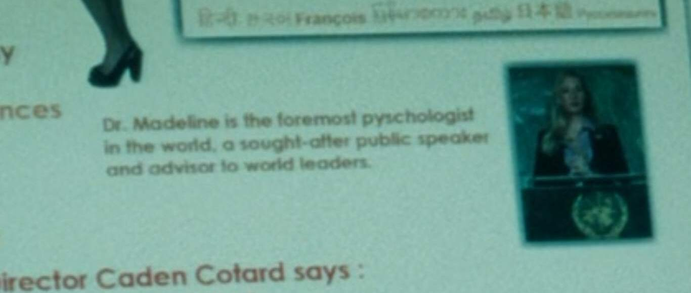
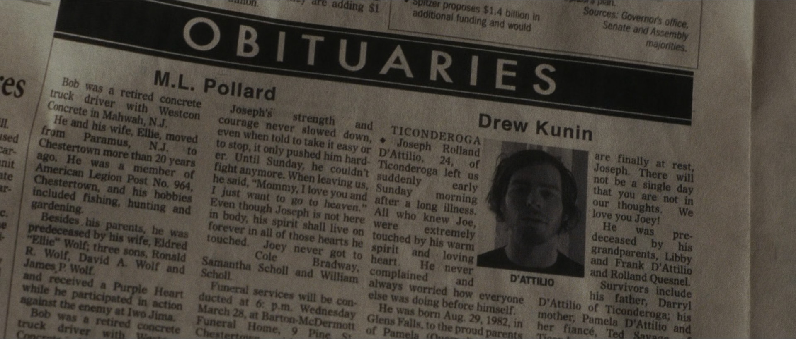

\thispagestyle{empty}
\newpage

\begin{abstract}
\noindent The purpose of this paper is to analyze Charlie Kaufman's directorial debut \emph{Synecdoche, New York}; highlight the film's internal and metafictional themes; discuss the story's characters; and study its plot. This paper, also, investigates the notion of the Kaufmanesque, relate literary references made in the story to it, and discusses the representation versus reality aspect of the film from a postmodern perspective (both in form and content) through the work of Jean Baudrillard, examining Sammy Barnathan as a simulacrum for Caden Cotard.\newline\newline
\textbf{\emph{Keywords:}} Film Analysis; Charlie Kaufman; Postmodern film.
\end{abstract}

\newpage

\setcounter{tocdepth}{2}
\tableofcontents

\listoffigures

\newpage

\section*{\center{Acknowledgement}}
\addcontentsline{toc}{section}{Acknowledgement}

I would like to express my gratitude for my supervisor Dr. Tarik Bouguerba for providing his invaluable guidance, upholding academic integrity, and holding us to high standards throughout the course of the project. \newline

\noindent I would, also, like to thank Mr. Charlie Kaufman for making this extraordinary film. I can only wish him well with his next projects.

\newpage

# Introduction

After its premiere at the 61^st^ Annual Cannes Film Festival on May 23, 2008, with a running time of 124 minutes, Charlie Kaufman's directorial debut, _Synecdoche, New York_, triggered an ambivalent range of reviews. As The Observer's own Rex Reed writes: "no matter how bad you think the worst movie ever made ever was, you have not seen _Synecdoche, New York_," \autocite{reed-2008} Pulitzer Prize winner Roger Ebert declares _Synecdoche_\footnote{\emph{Synecdoche, New York} will often be referred to as \emph{Synecdoche} throughout the paper.} film of the decade \autocite{ebert-2009}. The film has garnered a critics score of 68% and an audience score of 71% on Rotten Tomatoes\footnote{The critics score is also known as Tomatometer. See \autocite{rotten-tomatoes}.}, which illustrates a degree of polarization, perhaps best summarized in Peter Bradshaw's review \autocite{bradshaw-2009} where he states: "The film is either a masterpiece or a massively dysfunctional act of self-indulgence and self-laceration."

## Filmmaker

Charles Stuart Kaufman is an American screenwriter and director. Started as a television writer, Kaufman achieved critical acclaim and recognition for writing _Being John Malkovich_ \autocite{jonze-1999} and went on to be responsible for scripts of other distinguished films such as _Adaptation_ \autocite{jonze-2002} and _Eternal Sunshine of the Spotless Mind_ \autocite{gondry-2004}, which earned him an Academy Award in 2004.

Kaufman is unique in that he is a screenwriter that is credited on an equal footing as the directors in his films if not slightly more. _Eternal Sunshine of the Spotless Mind_, for instance, is more regarded as a 'Charlie Kaufman film' than it is Michel Gondry's. Most people would have a hard time attributing Kaufman films to either Gondry or Spike Jonze, Kaufman's other lifelong collaborator, which goes to show how much of a distinctive voice he is in an increasingly non-reading world.

Kaufman's directorial debut, _Synecdoche, New York_, was largely unprofitable during its theatrical run, due to a globally crashing economy and a disingenuous marketing of the film as a comedy, generating a total of 4.47 million USD while having a production budget of 20 million USD \autocite{box-office-mojo}. Coupled with the fact that Charlie refuses to indulge in formulaic Hollywood screenwriting, _Synecdoche's_ financial failure set the ambitious now-director to a better part of a decade of stagnation.

## Synopsis

Summarizing _Synecdoche, New York_ without threading into the analysis is a difficult task as some scenes transform the plot under examination.

The story follows theater director Caden Cotard (Philip Seymour Hoffman). Aged 40, Caden is increasingly concerned with his health. After a successful restaging of the play _Death of a Salesman_, Caden seeks validation from his wife, Adele (Catherine Keener), who is a painter of miniature art. Adele thinks very little of Caden's work, reproaching him for being a 'tool' of regional theater. Later, she admits that she fantasizes about Caden's death to their therapist Madeleine (Hope Davis) to start a new life without guilt, which hurts Caden deeply.

Increasingly obsessed with his own mortality, Adele confronts Caden that she wants to go to Berlin for her show with just their 4 years of age daughter, Olive (Sadie Goldstein), leaving him for good. Devastated, Caden wipes Adele's painting studio clean and, later on, tries to reach her by phone, but she mistakes him for Ellen (Dianne Wiest), her cleaning lady, and, eventually, hangs up on him, after which, he goes into convulsions and struggles to call for emergency. At the hospital, Caden picks up a magazine that depicts Adele as a world-famous painter.

Subsequently, Hazel (Samantha Morton), the box office staff, attempts to have a relationship with Caden, but he ultimately rejects her out of his love for his family. Caden, then, receives a MacArthur Fellowship which he intends to use to create "something big and true and tough" and "finally put [his] real self into something" \autocite[00:36:55--00:37:06]{kaufman-2008}.

Filled with loneliness and regret, Caden tries to mend his relationship with Hazel but settles for Claire (Michelle Williams), an actress of his. Caden marries and has a daughter with Claire. He, then, becomes aware that his first daughter, Olive, at the age of 10, has a full-body tattoo and goes to Germany in search of her where he meets Maria (Jennifer Jason Leigh), Adele's best friend, who proclaims that she tattooed Olive. In continuous search of his daughter, Caden learns that Olive exhibits her body in a peep show to strangers. He finds her but fails to get her attention and comes back empty-handed.

Backed by the MacArthur grant, Caden's autobiographical play develops into a spatially impossible, mind-bending creation: an infinitely nested full-sized replica of New York City inside a warehouse.

After getting fired from her job and in desperation, Hazel reconnects with Caden and takes the role of assistant in his play. Shortly after that, Sammy (Tom Noonan) auditions to play Caden and reveals that he has been following him for 20 years, and Caden agrees to cast him. This latter reveals to Caden Adele's whereabouts and Caden is granted access to Adele's apartment as Ellen.

Informed by Maria, Caden meets Olive on her deathbed. She asks him to ask for forgiveness for abandoning her and for being a homosexual, which he does, but she is unable to forgive him and dies.

Back in the warehouse, Caden interviews Millicent Weems (Dianne Wiest\footnote{Dianne Wiest is credited both as Ellen Bascomb and Millicent Weems.}), and she gets to play the role of Ellen, the cleaning lady. Meanwhile, Sammy expresses that he likes Hazel, and she plays along with it, hoping to make Caden jealous. When Caden gets wind of this, he revives his relationship with Hazel by confessing his longing for her, leading to Sammy's suicide. The crew holds a funeral for him.

Old Caden and Hazel get together in her ever-burning, smoke-filled house and, they express feelings of yearning for one another and regret the wasted years. When Caden wakes up, he finds that Hazel died of smoke inhalation and determines that he will make the play about the day before she died as "it was the happiest day of [his] life. And [he'll] be able to relive it forever." \autocite[01:44:09--01:44:40]{kaufman-2008}

With Caden's role vacant, Millicent, who plays Ellen, steps up and convinces Caden to give her the role. At the rehearsal of Sammy's funeral's scene, Millicent, as the director, engages with the actors and gives them direct cues, and their performance impacts idle Caden emotionally. After Caden admits that he is out of ideas, Millicent suggests that she takes over him, temporarily, and he is cast to play Ellen in Millicent's stand as "[he does] like to clean" \autocite[01:49:59]{kaufman-2008}.

At Millicent's direction, Caden puts on an earpiece that she uses to command every move of his. She instructs him to wipe himself, clean, walk, and have dreams. As he walks through abandoned, body-filled warehouse after warehouse, he meets Ellen's mother and apologizes for disappointing her terribly, and asserts that "[he] knows how to do the play now," \autocite[02:00:03]{kaufman-2008} and by Millicent's direction, he dies.

# Review

## Structure and Literary Devices

Kaufman -- similar to his subject, Caden -- sets out to explore existence as honestly as possible. At a first glance, the conflict in _Synecdoche_ is an internal _Man versus Self_ conflict, but the case could be made for _Man versus Nature_ and _Man versus Fate_ conflicts (Caden's own ailments, decay, and eventual demise). These supposed conflicts are never overcome in the story, which arguably, renders them less of literary elements and more of a by-product of an honest account of human life.

As Burgass notes that "postmodern fiction is often and appropriately characterized by a concern with ontological categories, and exploration of the boundaries between fact and fiction, the world and the text," \autocite[177]{burgass-2000} Kaufman, evidently, concerns himself with the ontological; blurs the line between fact and fiction (e.g., Olive's self-writing diary, Madeline's self-erasing book, and Hazel's burning house, etc.); utilizes metafictional elements (defined as a self-conscious form of fiction that reminds its viewer that they are viewing fictional work, coming to be associated with postmodern literature in the mid-twentieth century \autocite{metafiction};) and proceeds to deconstructs linear time. Therefore, his story is a postmodern one.

## Film as philosophy

_Synecdoche, New York_ concerns itself with questions of being and the examined life (through art). And as more philosophers have become interested in discussing this century-old medium (film), a question worth asking is can a film be philosophical. According to Shaw, a film can be philosophical in three ways: (1) if it poses philosophical questions; (2) if philosophical concepts can be applied to it to better understand it; (3) if it discusses a philosophical concept, openly \autocite[112]{shaw-2006}. _Synecdoche_ is a philosophical film in the first and second ways. First, it raises questions such as, what does it mean to be me? How do I fit into the world? And, intentionally, tries to make the viewer 'less lonely' \autocite[9:20]{kaufman-2017} by providing a critique of solipsism. And secondly, the film has been discussed through a Heideggerian lens \autocite{saxena}.

## On the Kaufmanesque

Most writing and research on _Synecdoche, New York_ is in the context of Kaufman's body of work and what is dubbed the 'Kaufmanesque', suggesting that Kaufman has enough of a distinct voice to the point where his themes and the way he deals with them are influential and recognizable \autocite[3]{larocca-2011}. Kaufman maintains that "[he does not] know what it means," \autocite{clarke-2020} reiterating that "the stuff that comes out that invokes [his] name doesn’t feel like stuff [sic] [he] would do." \autocite{clarke-2020}

However, Film critic Kevin Maher writes \autocite{maher-2006} "Kaufmanesque [is] up there with “Spielbergian”, “Disneyesque” and “Hitchcockian” as one of the few personality-based adjectives to have entered moviespeak," defining Kaufmanesque as "typically describ[ing] a madcap narrative in which a sweetly bamboozled protagonist is confronted by a metaphysically unstable world that can be redeemed only by core values such as romantic love or artistic truth." After citing films that the term applies to, he jokingly reduces it to "A man wakes up one morning and discovers . . ."

If there is, in reality, a distinct conception of a Kaufmanesque work, 'surreal' is not a word you would use to describe it. In fact, Kaufman sets himself apart from the likes of David Lynch and Alejandro Jodorowsky by being transparent and upfront. Whereas surreal art and cinema use uncommon imagery to invoke a response, Kaufman does not resort to randomness but takes refuge in the mundane: a diary, a cubicle, etc., and subject these things to dream-logic to tackle specific themes of human emotion, self-expression, and aloneness in the world.\newline

## Literature

There is no shortage of online articles and reviews trying to interpret _Synecdoche, New York_. A common interpretation, which this paper does not aim to further, is that Caden Cotard is in purgatory. Champions of this interpretation cite the sheer amount of references to death and Millicent description of Caden:

> Caden Cotard is a man already dead. He lives in a half world between stasis and antistasis. And time is concentrated, chronology confused. Yet up until recently, he's strived valiantly to make sense of his situation. But now he's turned to stone. \autocite[01:45:36]{kaufman-2008}

Another common interpretation of what happens in the film is the idea of Caden being in a dream. Supported by the clocks at the beginning and end of the film (see figure \ref{clocks}). Coupled with the professor on the radio talking about "the beginning of the end" and Hazel's line "The end is built into the beginning", it is clear how one might deduce a time stop between the beginning of the film and its end.

\begin{figure}
\captionsetup[subfigure]{labelformat=empty}
\begin{subfigure}{.5\textwidth}
  \centering
  \includegraphics[width=.8\linewidth]{./images/clock-start.jpg}
  \caption{}
  \label{fig:clock-start}
\end{subfigure}
\begin{subfigure}{.5\textwidth}
  \centering
  \includegraphics[width=.8\linewidth]{./images/clock-end.jpg}
  \caption{}
  \label{fig:clock-end}
\end{subfigure}
\caption{Time that reads 7:45 in the beginning and end of the film.}
\label{clocks}
\end{figure}

Lastly, Jungian psychology has been used extensively to explain Caden's transformation into Ellen \autocite{minors-2013}.

## Criticism

_Synecdoche, New York_ has been criticized heavily for its non-traditional structure and inaccessibility. Contrasted by _The Matrix Reloaded_ \autocite{wachowski-2003}, Jared Bauer explains that _Synecdoche_ is "more fun to think about and research than it is to watch," and that "if [Kaufman] is going to imbue [his] work with all these cryptic meanings . . . [he] got to give people something. With _The Matrix_, it's badass fight scenes. With [_Synecdoche, New York_], they give you nothing." \autocite{bauer-2018}

# Analysis

_Synecdoche, New York_ explores themes of solipsism, time passage, and life choices. However, the most prominent theme in the film is death; even though the film itself would disagree as Sammy, Caden's double, affirms that "this is not a play about dating. It's about death," to which Caden replies: "It is a play about dating. It's not a play just about death. It's about everything. Dating, birth, death, life, family. All that." \autocite[01:23:40--1:24:06]{kaufman-2008} \newline

As many critics have pointed out, the word Synecdoche in the title is a figure of speech in which a part stands in for the whole or vice versa (e.g., referring to cars as 'wheels' or asking someone's 'hand' in marriage). As an honest attempt to portray human life, the title's significance in the context of the film is a metafictional one. The film represents human beings and tries to make philosophical assessments of what it means to be a human as conveyed by Millicent's monologue near the end of the film:

> What was once before you, an exciting and mysterious future is now behind you, lived, understood, disappointing. You realize you are not special. You have struggled into existence and are now slipping silently out of it. _This is everyone's experience. Every single one. The specifics hardly matter. Everyone is everyone._ \autocite[01:55:29--1:55:56]{kaufman-2008}

The title is also a wordplay on the city the story takes place in, initially: Schenectady, New York.

## Characters

### Caden

Caden, the protagonist of the story, is a playwright who uses art to make sense of his own choices and ways. He is characterized by a constant obsession with death, illness, and having feelings of loneliness and unhappiness. Evident by his words to Hazel ("I don't want you to be okay. I mean, I do but it rips my guts out." \autocite[00:59:29--1:00:00]{kaufman-2008}), Caden is a self-centered individual that wants to be looked at and admired, despite prioritizing his own good over everyone else's.

Meant to be representative of all human beings, Caden struggles with his work as he is constantly reminded that others have it figured out and are wildly successful (e.g., his wife, four-year-old writer Horace Azpiazu, his daughter's stepfathers).

### Hazel

Hazel is the down-to-earth character in the film with unabashed conduct. She is sexually aggressive with a suggestive sense of humor. She is devoted to Caden and never ceased to love him, but she is proud and knows when to let go, nevertheless. Despite her prole outlook, Hazel tries to improve herself by reading literature. In a scene from the script that did not make it to the film, she is constantly reading the first sentence from _Swann's way_ and complains to Caden, after which he advises her to "read the first line of another series of books." \autocite[15]{kaufman-2007}

### Claire

Claire is a transparent character with a fitting name. She is beautiful, but also naive and, by her admission, stupid. She stars in Caden's plays, and she abundantly references works of art out of context and uses words in the wrong way (e.g., her 'Freudian slip'). Caden exploits her naivety and uses her as a placeholder for his first wife. She leaves Caden after getting fed up with his unfaithfulness.

### Adele

Adele Lack is a carefree, untroubled, and bohemian character. She is miserable with her husband Caden but feels guilty about it. Not supportive of his work, Adele uses demeaning language to convey her dissatisfaction with Caden, calling him a disappointment and lying in the next breath about loving him. As a painter, her work, in contrast to her husband's, is small and full of passion, while his is cold, and vast in size.

### Olive

Caden's daughter. She is distanced from her father at a young age and was creepily groomed to be a lover of her mother's best friend. She has a full-body tattoo of flowers, and thus, symbolizes life. Caden keeps looking for her, but she is always out of his reach. She dies unable to forgive her father for abandoning her.

### Maria

As Adele's best friend, Maria motivates her to leave Caden, whom she holds in contempt. She serves as a proxy between the two (e.g., sitting between them in the theater, and being sent to talk to him in Berlin). Despite knowing Olive since she was an infant, Maria made a lover out of Olive and poisoned her with flower tattoos that caused her very death.

### Millicent Weems/Ellen Bascomb

Adele's cleaning lady. She stars in Caden's play and later proves to be more capable of directing than him, taking his role as a director in the process.

### Madeline

Caden and Adele's therapist. She, oddly, replies to her client before they finish their speech and maintains a professional, confident look. She talks in clichés and professes in product placement and plugging her work to her clients.

### Sammy

Caden's stalker. He has the ability to know what Caden thinks and has a queer interest in exploring Caden's mind. He commits suicide out of love for Hazel.

## Themes

### Life choices

Kaufman emphasizes the idea that we face an infinite amount of choices every day and we act upon these choices carving our past, and thus, our future in the process. When Caden goes out with Hazel and learns of her mother's death, he ends up marrying her. Similarly, when Caden refuses to act on Madeline's advances, her books suddenly reads "I show you my leg. I stand close, and you inhale my perfume. I offer my ripe flower to you and you deny it. This book is over," \autocite[00:48:57--00:49:23]{kaufman-2008} and all subsequent pages are blank, marking the end of that timeline for Caden. This is further enforced by the minister's speech at the acting of Sammy's funeral:

> There are a million little strings attached to every choice you make; you can destroy your life every time you choose. But maybe you won't know for twenty years. And you'll never ever trace it to its source. And you only get one chance to play it out. Just try and figure out your own divorce. And they say there is no fate, but there is: it's what you create. \autocite[01:47:02]{kaufman-2008}

\noindent Kaufman regards choosing as a dangerous act. Anytime you choose, you could be making your last choice. In another scene from the script that did not make it to the film, Hazel sets out multiple options for Caden to choose from and he says "Do I have to choose at all?" to which she replies "No, I suppose not. Choosing is not your strong suit." \autocite[37]{kaufman-2007}

### Solipsism

Defined as the belief that only one's own mind exists. It is no coincidence that for his magnum opus, Caden wants to explore and find his 'real self.'

Caden's solipsism relates every minor thing to him. He projects himself on posters and television infomercials, his state of mind on magazines, and sees his own failure as a husband and father in bold text around him (see figure \ref{projections}). Even Madeline's web site's domain name he visits is "www.cadenstherapist.com" (Caden's therapist), as he only sees the therapist as _his_.

\begin{figure}
\captionsetup[subfigure]{labelformat=empty}
\begin{subfigure}{.5\textwidth}
  \centering
  \includegraphics[width=.8\linewidth]{./images/caden-on-poster.jpg}
  \caption{Caden on Azpiazu's work.}
  \label{fig:caden-on-poster}
\end{subfigure}
\begin{subfigure}{.5\textwidth}
  \centering
  \includegraphics[width=.8\linewidth]{./images/caden-on-tv.jpg}
  \caption{Caden on television.}
  \label{fig:caden-on-tv}
\end{subfigure}
\begin{subfigure}{.5\textwidth}
  \centering
  \includegraphics[width=.8\linewidth]{./images/caden-in-website.jpg}
  \caption{Caden quoted on Madeline's website.}
  \label{fig:caden-in-website}
\end{subfigure}
\begin{subfigure}{.5\textwidth}
  \centering
  \includegraphics[width=.8\linewidth]{./images/adele-on-magazine.jpg}
  \caption{Magazine depicting Caden as an ugly-face loser.}
  \label{fig:adele-on-magazine}
\end{subfigure}
\caption{Caden's projections.}
\label{projections}
\end{figure}

Before he dies, Sammy laments Caden's solipsism saying: "I've watched you forever, Caden. But you've never really looked at anyone other than yourself." \autocite[1:39:12]{kaufman-2008} Caden's response to Sammy's suicide was directing him to 'get up'.

As the film progresses, we can see glimpses of an apocalyptic reality that Caden never seems to concern himself with to the point that he has to ask where everyone is at the end of the film.

## Critical Analysis

The story is seen through the eyes of the unreliable narrator Caden Cotard. A fade in from a solid gray color starts the film to the sight of a digital clock waking up Caden at 7:45. The radio announces that it is September 22. In a seemingly single morning scene, time moves unusually: The barely audible radio in the kitchen announces that it is October 8; Caden starts reading a paper dated October 14, a single day behind a newly announced date on the radio, as if a day has already passed since Caden had grabbed his paper \autocite[12:32--12:42]{yms-1}; News bites section indicate that it is October 17; Milk expiration; Halloween announcement; November 2 at the obituaries page (see figure \ref{morning-scene}).

\begin{figure}
\captionsetup[subfigure]{labelformat=empty}
\begin{subfigure}{.5\textwidth}
  \centering
  \includegraphics[width=.8\linewidth]{./images/morning-scene-1.jpg}
  \caption{October 14.}
  \label{fig:morning-scene-1}
\end{subfigure}
\begin{subfigure}{.5\textwidth}
  \centering
  \includegraphics[width=.8\linewidth]{./images/morning-scene-2.jpg}
  \caption{October 17.}
  \label{fig:morning-scene-2}
\end{subfigure}
\begin{subfigure}{.5\textwidth}
  \centering
  \includegraphics[width=.8\linewidth]{./images/morning-scene-3.jpg}
  \caption{October 20.}
  \label{fig:morning-scene-3}
\end{subfigure}
\begin{subfigure}{.5\textwidth}
  \centering
  \includegraphics[width=.8\linewidth]{./images/morning-scene-4.jpg}
  \caption{November 2.}
  \label{fig:morning-scene-4}
\end{subfigure}
\caption{Rapid passage of time in a single scene.}
\label{morning-scene}
\end{figure}

When Caden steps out to get his mail, he is surprised to find a magazine called _Attending to your Illness_ addressed to him with a full-page advertisement for _Flurostatin TR_ drug on the back of it; the very same drug from the television infomercial in Adele's studio cleaning scene \autocite[00:26:46--00:27:12]{kaufman-2008}. Caden will later mention that he thinks he has Arthritis and a radio news report from his car will state "German pharmaceutical giant has won its libel suit against patients claiming chromosomal damage from use of the arthritis medication," \autocite[00:58:56]{kaufman-2008} which could explain Caden's transformation into Ellen near the end of the film.

Inside the house in an apparent obsession with death, Caden misreads a piece of news about the playwright Harold Pinter. At the news bites section, he voices the news of a deadly flu found in Turkey. By contrast, Olive protests about her green poop, proclaiming that "everything's alive." \autocite[00:03:11--00:03:26]{kaufman-2008} This illustrates how much Caden is consumed with death, and how when you are a child, you don't have a grasp on mortality yet. It is also worth mentioning that Caden only ever knows his daughter Olive as a child, and in this sense, she symbolizes life for him.\newline

While trying to shave, a faucet explodes and hits Caden's forehead. This starts a series of ailments and deteriorating bodily functions that come and go, something every human being has to endure. Despite his hypochondria and excessive focus on his failing body, Caden outlives everyone around him. Inversely, foreshadowed in her first appearance in the film, Caden's wife, Adele, ignores her constant coughing and dies of lung cancer.

At the hospital, Christmas ornaments hanging in the back can be seen, suggesting yet another impossible time passage, exemplifying how most people postpone their medical appointment.

In their ride back home, we see that Caden and Adele have different approaches to parenting, as Adele is only concerned with a comfortable, although oblivious Olive, Caden seeks to be factually correct. Moreover, Caden and Adele's opposition carries over to their art: Adele's miniature art keeps getting smaller until you need magnifying glasses to view it, whereas Caden's art grows infinitely larger \autocite{kaufman-2013}.\newline

At rehearsal, Caden is at the director's table. Tom (Daniel London) is acting out a scene from _Death of a Salesman_. Originally by Arthur Miller, _Salesman_ is about the death of Willy Loman who, similar to Caden, strives to be well-liked, well-known, and appreciated for his work. After an accident at the set, Tom emerges from a car and meets Caden who, metafictionally, instructs him:

> Try to keep in mind that a young person playing Willy Loman thinks he's only pretending to be at the end of a life full of despair. But the tragedy is that we know that you, the young actor, will end up in this very place of desolation. \autocite[00:10:19]{kaufman-2008}

\noindent This is the first instance where Kaufman's postmodern tendencies reveal themselves. Much like the film is a representation of human life, this quote is directed at the actor playing Tom (Daniel London) more than it is directed at Tom.

Taking a break from rehearsal, Caden exits the theater in search of a cell phone signal passing the box office where Hazel sits reading _Swann's Way_, the first volume of _In Search of Lost Time_. Caden mentions that he's searching for a signal, to which Hazel replies that the "signal's good here" \autocite[00:11:01]{kaufman-2008} as she pats her lap. She later directs Caden through a suggestive conversation revealing interest in him. This hints at one of the film's themes: taking decisions in one's own life. Caden, who works as a director professionally, is in need of directions himself, unable to act on his impulses, and will eventually be directed to die.\newline

In Couples Therapy, the film introduces Madeline. Characteristic of other professionals and health specialists in the film, Madeline is comically constructed. She is praised as "one of the foremost psychologists in the world, a sought-after public speaker, advisor to world leaders" in her own website (see figure \ref{foremostpsychologist}), yet she speaks in platitude (e.g., "There are no terrible things to say in here, only true and false." \autocite[00:11:55]{kaufman-2008}) Madeline, also, starts her lines before her client's end. This is, perhaps, to illustrate that she had had those conversations before and knows them all too well, hinting at the theme of the universality of human experience the film is interested in conveying.

Adele confesses that she fantasized about Caden dying so she could start a guilt-free life without him, expressing how broken and unsatisfactory her marriage has become. She, then, misses his premiere on the excuse that she has to work, but instead, she gets drunk with her best friend Maria. When she finally sees it, she vilifies Caden's efforts. Despite the standing ovation he receives, Caden fixates on Adele's opinion and seeks nothing but her validation.\newline

Akin to previous scenes in the film, what follows corresponds to the same erratic time passage: A morning that spans 3 or 4 months. Caden opens his newspaper on May 25, 2006, and flips to the obituaries where a person named D'Attilio, born on August 29, 1982, dies at the age of 24, which makes his death somewhere after August 29, 2006 (see figure \ref{dattilio}) \autocite{palakon-2012} In this scene, Adele, motivated by Maria, tells Caden her intentions to go to Berlin with just Olive. Meaning that in reality, it took Adele 3 or 4 months to come to grips to leaving Caden.

Following Adele's departure to Berlin with Olive, Caden starts furiously cleaning Adele's studio. Later in the film, Caden takes the role of Ellen on the basis that "[he does] like to clean."\autocite[01:49:59]{kaufman-2008} Caden is also seen cleaning random bathrooms from the warehouse. Many reviewers suggest that Caden finds salvation in cleaning, evident by the upbeat tone of the television once Caden starts cleaning (e.g., "rise and shine; lift those legs," \autocite[00:27:35]{kaufman-2008}) that changes to a morbid cartoon singing about Caden's death only once Caden finishes cleaning, referencing Adele's desertion:

> There’s no real way of coping\newline
> When your parachute won’t open\newline
> You’re going down\newline
> You fell\newline
> Then you died\newline
> Maybe someone cried\newline
> But not your one-time bride\autocite[00:27:38]{kaufman-2008}

Back in therapy, Caden expresses his loneliness and desire to fulfill Adele's vision for him. Another aspect of Madeline that is revealed is that her footwear is too tight to the point that her feet have blisters. This symbolizes a professional facade Madeline tries to maintain; that even a therapist who tries to help people mediate their issues has issues of her own. This is enforced by her reading one of her self-help books later in the film.\newline

Caden, then, attempts to reach Adele by phone and she mistakes him for Ellen. He goes into convulsions, and upon calling 911, the operator mistakes him for a female. At the hospital, Caden picks up a magazine that features Adele on the front page (see figure \ref{projections}) and scrolls to where it says:

> Six months ago, Adele was an under-appreciated housewife in Eastern New York. Stuck in a dead-end marriage to a slovenly ugly-face loser, Adele Lack had big dreams for her and her then four-year-old daughter, Olive. That's when her paintings got small. \autocite[00:30:32]{kaufman-2008}

\noindent Inseparably, Olive's diary reads:

> How I love Maria! She is so much more of a father than Caden ever was, with his drinking and unfortunate body odor and rotting teeth. I could only loathe him and perhaps pity him. \autocite[00:56:03]{kaufman-2008}

\noindent This suggests that Caden is only projecting these thoughts of his negligence and inadequacy onto his wife and daughter. After all, he was the one to walk away when Adele announced that she wanted to go to Berlin without trying to change her mind. However, Caden's projections and solipsism will be overcome when Sammy takes his own life, after which Caden will have a eureka moment and start thinking of Sammy, not as an extension of himself, but as someone who had a life outside of his duties as Caden \autocite[34]{devers-2011}. Caden will proclaim:

> I know how to do it now. There are nearly thirteen million people in the world. Try to imagine that many people! None of those people is an extra. They're all the leads of their own stories. They have to be given their due. \autocite[01:40:02]{kaufman-2008}

\noindent and as a consequence, he will experience the happiest day of his life with Hazel.\newline

Caden and Claire get together to discuss her future role, and that event leads to Caden marrying Claire. To Caden, Claire is nothing short of a placeholder for his first wife Adele. It is worth mentioning that when they first have sex, the specific song from the soundtrack playing is called 'Sex Based Decision Making' \autocite{brion-2008-sex} to illustrate that Caden's engagement to Claire was simply an act on an impulse \autocite[04:42--4:48]{yms-3}. Caden ends up having a daughter with Claire; and after he learns of his first daughter's full-body tattoo, not only does he describe her as his 'real daughter' to the exclusion of his new one, he is shocked to discover Claire, too, has a giant tattoo on her back, saying "[he has] never seen that before," \autocite[00:48:07]{kaufman-2008} enforcing her second-class status to him.\newline

The film reiterates on its postmodern premise when Caden, in search of the essence of his life, hires actors to play actors. After all, the production of his art has to be included in his art if Caden wishes to portray his life realistically.

Caden, at some point, will suggest naming his play-within-play 'Simulacrum', which is, simply put, a representation of someone or something. But, according to postmodern French philosopher Jean Baudrillard, a simulacrum is the copy that becomes autonomous in its own right, bearing no relation to any reality whatsoever \autocite{baudrillard-1994}. Accordingly, Sammy, Caden's representation, is a more aggressive, more dedicated -- for better or worse -- version of Caden. A representation that seeks to "see how [Caden] loses even more of himself." \autocite[01:09:45]{kaufman-2008}

Defining the postmodern condition as a superstitious attitude toward narratives (e.g., a non-religious person who prays 'just for the experience,') acting as if a narrative is true without believing that narrative to be true is at the center of a postmodern setting. Likewise, Claire, Caden's wife, starts using the simulation to communicate with her husband: "[To Sammy] Do you have any idea what I've given up for you? For this? [To Caden] For you? For you?" She is appalled by this, and eventually, the simulation will cause her to disconnect herself from the real saying to Caden: "I want you out of the apartment. The real one. You can keep this one." \autocite[01:16:16]{kaufman-2008} Sammy saying what Caden thought (that he will clean Hazel's toilet) was the copy overriding reality.

Baudrillard affirms that the representation becomes at the forefront with reality taking a back seat in a postmodern setting. And we can see this as Caden learns things about reality from his representative, Sammy. Not only that Sammy was the one who tracked Adele's apartment, but he also, hinted at his admiration for Hazel as he was representing Caden; and from Caden's body language, we can assert that he himself did not know.

Subsequently, Sammy tries to replace Caden by liking Hazel on the excuse that he was being Caden, after which Caden explains to him that "this Hazel doesn't exist for you. If you wanna like a Hazel, like that one [pointing at Hazel's double]."

Much like Maher defines Kaufmanesque as a narrative in which "[the] protagonist is confronted by a metaphysically unstable world that can be redeemed only by core values such as romantic love or artistic truth." \autocite{maher-2006}, Kaufman's Caden and Hazel overcome their postmodern situation by expressing their love for one another, leading to Sammy's suicide.\newline

Although Caden never finishes his play, his endeavor to uncover the truth about his reality through art was not fruitless. This is, perhaps, best articulated at the end of the film where Caden walks from warehouse to warehouse at the direction of Millicent. Within each warehouse, there is less abstraction and attention to detail, but most importantly, Madelin's self-help books, scattered on the ground, become more helpless and 'real' (see figure \ref{madelines-books}), the more Caden goes deeper in his art. A review of Madeline's last book read "_i don't feel well today_ is easily Dr. Gravis's most honest, brutal, work to date," \autocite[1:56:46]{kaufman-2008} which what Caden sets out to do with his work.

\begin{figure}
\captionsetup[subfigure]{labelformat=empty}
\begin{subfigure}{.5\textwidth}
  \centering
  \includegraphics[width=.8\linewidth]{./images/madeline-happy.jpg}
  \caption{At warehouse one.}
  \label{fig:madeline-happy}
\end{subfigure}
\begin{subfigure}{.5\textwidth}
  \centering
  \includegraphics[width=.8\linewidth]{./images/madeline-sad.jpg}
  \caption{At warehouse four.}
  \label{fig:madeline-sad}
\end{subfigure}
\caption{Madeline's books.}
\label{madelines-books}
\end{figure}

## Literary references

### _Autumn Day_

The first literary reference that appears in the film is an excerpt from _Autumn Day_ by Rainer Maria Rilke \autocite{rilke-1984}, read in the film by a professor with a heavy German accent, which makes sense since the poem is German originally. The poem reads:

> Whoever has no house now, will never have one.\newline
> Whoever is alone will stay alone,\newline
> Will sit, read, write long letters through the evening,\newline
> and wander on the boulevards, up and down,\newline
> restlessly, while the dry leaves are blowing.

\noindent The poem was analyzed by the American literary critic Philip K. Jason as follows:

> _Autumn Day_ is a poem about time running out. Nature is approaching winter and must employ all of its force to produce the final fullness of fruit and vine before winter sets in. Similarly, Man approaches the twilight of his own life. He feels compelled to produce all the perfection of which he is capable before his time runs out in death.\autocite{jason}

\noindent This is reminiscent of Caden's swansong piece as he states: "I will be dying. And so will you. And so will everyone here. And that's what I wanna explore." \autocite[00:41:56--00:42:11]{kaufman-2008} Evidently, Caden never succeeds and winter (death) catches to him.

### _Death of a Salesman_

_Death of a Salesman_ by Arthur Miller is a love story between a father and his son, much like _Synecdoche_ is about a father and his daughter. In Caden's production, Willy and Linda Loman are younger than Biff and Happy. Caden says to Tom, the young actor playing Willy Loman:

> Try to keep in mind that a young person playing Willy Loman thinks he's only pretending to be at the end of a life full of despair. But the tragedy is that we know that you, the young actor, will end up in this very place of desolation. \autocite[00:10:19]{kaufman-2008}

\noindent This is a metafictional device, but it can also be interpreted in the context of Caden's twist on the play to try to illustrate millennials' economical angst and the universality of emotions of helplessness across ages. Not only that but Caden's inability to direct or take decisions, as apparent with his pleas to Hazel to tell him what to say next or what to do with his life, is resemblant to Willy's inability to take his own life or make critical decisions. For this reason, Kaufman includes the lines "Ben, where do I? Ben, _how_ do I?" in Caden's play \autocite[34]{devers-2011}.

### _In Search of Lost Time_

At the box office, Hazel is seen reading the first volume _Swann's way_ of _In Search of Lost Time_ by Marcel Proust which is where the protagonist's last name comes from. The character Dr. Cottard from _Lost Time_ is, in turn, based on a colleague of Proust's father at the Paris faculty of medicine named Jules Cotard \autocite{child-2010}. This latter is best known for describing Cotard's syndrome, a delusional belief that one is dead or lacking a part of their body. Similarly, Caden Cotard thinks he is dying.

# Conclusion

_Synecdoche, New York_ aims to reflect on existence through metafiction. The film highlights all stages of life: childhood innocence, fearful adulthood, and seeing all your loved ones die one by one. Seen through a postmodern lens, the film offers a critique of solipsism.

\newpage

\section*{Works Cited}
\addcontentsline{toc}{section}{Works Cited}
\defbibheading{bibliography}
