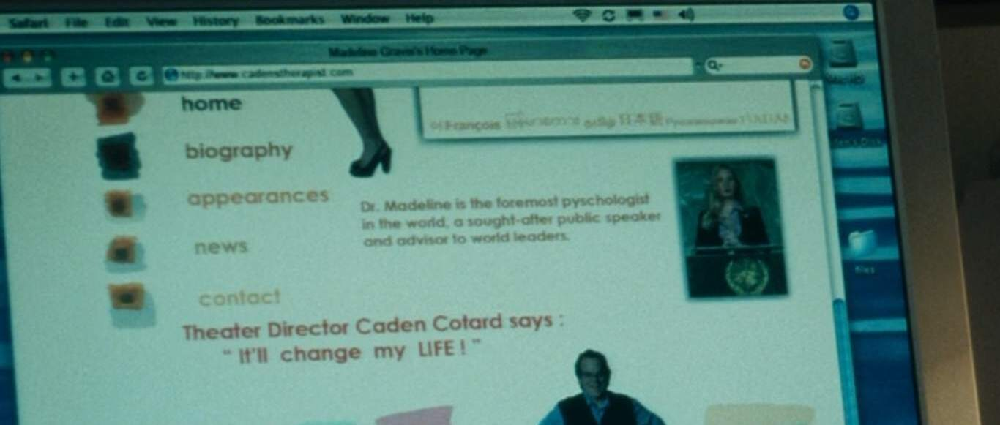
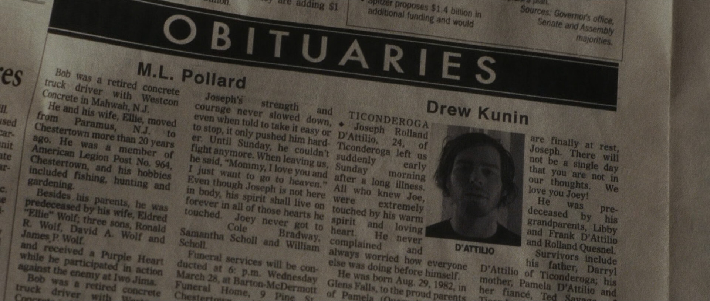
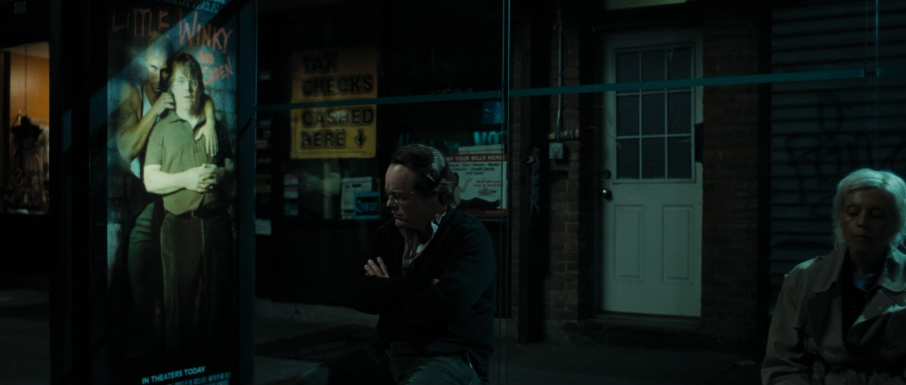

\newpage

\section*{\center{Acknowledgement}}
\addcontentsline{toc}{section}{Acknowledgement}

Thank y'all.

\newpage

# Introduction

After its premiere at the 61^st^ Annual Cannes Film Festival on May 23, 2008, with a running time of 124 minutes, Charlie Kaufman's directorial debut, _Synecdoche, New York_, triggered an ambivalent range of reviews. As The Observer's own Rex Reed writes: "no matter how bad you think the worst movie ever made ever was, you have not seen _Synecdoche, New York_," ^[@reed_2008.] Pulitzer Prize winner Roger Ebert declares _Synecdoche_ ^[_Synecdoche, New York_ will often be referred to as _Synecdoche_ throughout the paper.] film of the decade ^[@ebert_2009.]. The film has garnered a critics score of 68% and an audience score of 71% on Rotten Tomatoes ^[The critics score is also known as Tomatometer. See @rotten_tomatoes.], which illustrates a degree of polarization, perhaps best summarized in Peter Bradshaw's review ^[@bradshaw_2009.], where he states: "The film is either a masterpiece or a massively dysfunctional act of self-indulgence and self-laceration."

## Filmmaker

Charles Stuart Kaufman is an American screenwriter and director. Started as a television writer, Kaufman achieved critical acclaim and recognition for writing _Being John Malkovich_ ^[@jonze_1999.] and went on to be responsible for scripts of other distinguished films such as _Adaptation_ ^[@jonze_2002.] and _Eternal Sunshine of the Spotless Mind_ ^[@gondry_2004.], which earned him an Academy Award in 2004.

Kaufman is unique in that he is a screenwriter that is credited on an equal footing as the directors in his films if not slightly more. _Eternal Sunshine of the Spotless Mind_, for instance, is more regarded a "Charlie Kaufman film" than it is Michel Gondry's. Most people would have a hard time attributing Kaufman films to either Gondry or Spike Jonze, Kaufman's other lifelong collaborator. That goes to show how much of a distinctive voice he is in an increasingly non-reading world.

Kaufman's directorial debut, _Synecdoche, New York_, was largely unprofitable during its theatrical run, due to a globally crashing economy, generating a total of 4.47 million USD while having a production budget of 20 million USD ^[@box_office_mojo.]. Coupled with the fact that Charlie refuses to indulge in formulaic Hollywood screenwriting, _Synecdoche's_ financial failure set the ambitious now-director to a better part of a decade of stagnation.

## Synopsis

Summarizing _Synecdoche, New York_ without threading into the analysis is a difficult task as some scenes transform the plot under examination.

The story follows theater director Caden Cotard (Philip Seymour Hoffman). Aged 40, Caden is concerned with his health. "I don't feel well," ^[@kaufman_2008, 00:02:37.] he admits.

After a successful restaging of the play _Death of a Salesman_, Caden seeks validation from his wife, Adele (Catherine Keener), who is a painter of miniature art. Adele thinks very little of Caden's work, reproaching him for being a "tool" of regional theater. Later, she admits that she fantasizes about Caden's death to their therapist Madeleine (Hope Davis) to start a new life without guilt, which hurts Caden deeply.

Increasingly obsessed with his own mortality, Adele confronts Caden that she wants to go to Berlin for her show with just their 4 years of age daughter, Olive (Sadie Goldstein), leaving him for good. Devastated, Caden wipes Adele's painting studio clean and, later on, tries to reach her by phone, but she mistakes him for Ellen (Dianne Wiest), her cleaning lady, and, eventually, hangs up on him, after which, he goes into convulsions and struggles to call for emergency. At the hospital, Caden picks up a magazine that depicts Adele as a world-famous painter.

Subsequently, Hazel (Samantha Morton), the box office staff, attempts to have a relationship with Caden, but he ultimately rejects her out of his love for his family. Caden, then, receives a MacArthur Fellowship which he intends to use to create "something big and true and tough" and "finally put [his] real self into something" ^[@kaufman_2008, 00:36:55--00:37:06.].

Filled with loneliness and regret, Caden tries to mend his relationship with Hazel but settles for Claire (Michelle Williams), an actress of his. Caden marries and has a daughter with Claire. He, then, becomes aware that his first daughter, Olive, at the age of 10, has a full-body tattoo and goes to Germany in search of her where he meets Maria (Jennifer Jason Leigh), Adele's best friend, who proclaims that she tattooed Olive. In continuous search of his daughter, Caden learns that Olive exhibits her body in a peep show to strangers. In a booth, Olive dances naked to her father, and he fails to get her attention and comes back empty-handed.

Caden's autobiographical play develops into a spatially impossible, mind-bending creation: an infinitely nested full-sized replica of New York City inside a warehouse.

After getting fired from her job and in desperation, Hazel reconnects with Caden and takes the role of assistant in his play. Shortly after that, Sammy (Tom Noonan) auditions to play Caden and reveals that he has been following him for 20 years, and Caden agrees to cast him. Thereafter, Sammy hands Caden a slip of paper with Adele's address on it, and Caden goes there. In the hallway, Caden gets mistaken for Ellen, Adele's cleaning lady, and is given the keys to her apartment to clean it.

Informed by Maria, Caden meets Olive on her deathbed. She asks him to ask for forgiveness for abandoning her and for being a homosexual, which he does, but she is unable to forgive him and dies.

Back in the warehouse, Caden interviews Millicent Weems (Dianne Wiest ^[Dianne Wiest is credited both as Ellen Bascomb and Millicent Weems.]), and she gets to play the role of Ellen, the cleaning lady. Meanwhile, Sammy expresses that he likes Hazel, and she plays along with it, hoping to make Caden jealous. When Caden gets wind of this, he revives his relationship with Hazel by confessing his longing for her, leading to Sammy's suicide. The crew holds a funeral for him.

Old Caden and Hazel get together in her ever-burning, smoke-filled house and, they express feelings of yearning for one another and regret the wasted years. When Caden wakes up, he finds that Hazel died of smoke inhalation and determines that he will make the play about the day before she died as "it was the happiest day of [his] life. And [he'll] be able to relive it forever." ^[@kaufman_2008, 01:44:09--01:44:40.]

Caden, now, remarks that he needs someone to play him. Millicent, who plays Ellen, steps up and convinces Caden to give her the role. At the rehearsal of Sammy's funeral's scene, Millicent, as the director, engages with the actors and gives them direct cues, and their performance impacts idle Caden emotionally. After Caden admits that he's out of ideas, Millicent suggests that she takes over him, temporarily, and he's cast to play Ellen in Millicent's stand as "[he does] like to clean" ^[@kaufman_2008, 01:49:59.].

At Millicent's direction, Caden puts on an earpiece that she uses to command every move of his. She instructs him to wipe himself, clean, walk, and have dreams. As he walks through abandoned, body-filled warehouse after warehouse, he meets Ellen's mother and apologizes for disappointing her terribly, and asserts that "[he] knows how to do the play now," ^[@kaufman_2008, 02:00:03.] and by Millicent's direction, he dies.

# Literature Review

## Structure and Literary Devices

Kaufman -- similar to his subject, Caden -- sets out to explore, as honestly as possible, the essence of being. At a first glance, the conflict in _Synecdoche_ is an internal _Man versus Self_ conflict, but the case could be made for _Man versus Nature_ and _Man versus Fate_ conflicts (Caden's own ailments, decay, and eventual demise). These supposed conflicts are never overcome in the story, which, arguably, renders them less of literary elements and more of a by-product of an honest account of a human life.

As Burgass notes that "postmodern fiction is often and appropriately characterized by a concern with ontological categories, and exploration of the boundaries between fact and fiction, the world and the text," ^[@burgass_2000, 177.] Kaufman, evidently, concerns himself with the ontological, blurs the line between fact and fiction (e.g., Olive's self-writing diary, Madeline's self-erasing book, and Hazel's burning house, etc.), utilizes metafictional elements, and proceeds to deconstructs linear time. Therefore, his story is a postmodern one.

# Analysis

_Synecdoche, New York_ explores themes of existentialism, solipsism, passage of time, and life choices. However, the most prominent theme in the movie is death; even though the movie itself would disagree as Sammy, Caden's own doppelgänger, affirms that "This is not a play about dating. It's about death," to which Caden replies: "It is a play about dating. It's not a play just about death. It's about everything. Dating, birth, death, life, family. All that." ^[@kaufman_2008, 01:23:40--1:24:06.]

As many critics have pointed out, the word Synecdoche in the title is a figure of speech in which a part stands in for the whole or vice versa (e.g., referring to cars as 'wheels' or asking someone's 'hand' in marriage). As an honest attempt to portray human life, the title's significance in the context of the film is a metafictional one. The film represents human beings and tries to make philosophical assessments of what it means to be a human as conveyed by Millicent's monologue near the end of the film:

> What was once before you, an exciting and mysterious future is now behind you, lived, understood, disappointing. You realize you are not special. You have struggled into existence and are now slipping silently out of it. _This is everyone's experience. Every single one. The specifics hardly matter. Everyone is everyone._ ^[@kaufman_2008, 01:55:29--1:55:56.]

## Characters

### Caden

Caden, the protagonist of the story, is a playwright who uses art to make sense of his own choices and ways. He is characterized by a constant obsession with death, illness, and feelings of loneliness. Evident by his words to Hazel (I don't want you to be okay. I mean, I do but it rips my guts out." ^[@kaufman_2008, 00:59:29--1:00:00.]), Caden is a self-centered individual that wants to be looked at and loved, prioritizing his own good over any other's.

Meant to be representative of all human beings, Caden struggles with his own work as he's constantly reminded that others have it figured out and are wildly successful (e.g., his wife, four-year-old writer Horace Azpiazu, his daughter's step fathers).

### Hazel

Hazel is the most honest and down-to-earth character in the film. She is sexually aggressive with a suggestive sense of humor. She's devoted to Caden and never ceased to love him, but she's proud and knows when to let go, nevertheless. She is reminiscent of Pearl (Maureen Stapleton) from Woody Allen's _Interiors_ ^[@allen_1978.] with her prole outlook and unabashed conduct, compared to both Caden and Arthur's (E. G. Marshall) first wives. Yet, Hazel tries to improve herself by reading literature. In a scene from the script that did not make it to the film, she is constantly reading the first sentence from _Swann's way_ and complains to Caden, after which he advise her to "read the first line of another series of books." ^[@kaufman_2007, 15.]

### Claire

Claire is a transparent character with a fitting name. She's beautiful, but also naive and, by her own admission, stupid. She stars in Caden's plays, and she abundantly references works of art out of context and uses words in the wrong way (e.g., her 'Freudian slip'). Caden exploits her naivety and uses her as a placeholder for his first wife. She leaves Caden after getting fed up with his unfaithfulness.

### Adele

Adele Lack is a carefree, but cruel person who feels trapped and miserable with her first husband Caden but acts guilty about it. She's not supportive of his work and uses demeaning language to convey her dissatisfaction with him calling him a disappointment. As a painter, he work, in contrast to her husband's, is small and full of passion, while his is cold, brutal, and vast in size.

### Olive

Caden's daughter. She is distanced from her father at a young age and was creepily groomed to be a lover of her mother's best friend. She has a full-body tattoo of flowers and thus symbolizes life. Caden keeps looking for her, but she's always out of his reach. She dies unable to forgive her father for abandoning her.

### Maria

As Adele's best friend, Maria motivates her to leave Caden, whom she holds in contempt. She servers as a proxy between the two (e.g., sitting between them in the theater, and being sent to talk to him in Berlin). Despite knowing Olive since she was an infant, Maria made a lover out of Olive and poisoned her with flower tattoos that caused her very death.

### Millicent Weems/Ellen Bascomb

Adele's cleaning lady. She stars in Caden's play and later proves to be more capable of directing than him, taking his role as a director in the process. She is a more successful, yet identical version of Caden.

### Madeline

Caden and Adele's therapist. She talks in clichés, but, ultimately, maintains a professional confident look. She replies to her client before they finish their speech, and professes in product placement and plugging her own work to her clients.

### Sammy

Caden's stalker. Somehow, he has the ability to know what Caden thinks and seems to have a queer interest in exploring Caden's mind. He commits suicide out of love for Hazel.

## Plot Analysis

The story is seen through the eyes and experience of the unreliable narrator Caden Cotard. The movie fades in to a digital clock reading 7:44. As Caden wakes up at 7:45, the radio announces that it is September 22. In a seemingly single morning scene, the barely audible radio in the kitchen announces that it is October 8. When Caden steps out to get his newspaper and mail, he is surprised to find a magazine called _Attending to your Illness_ addressed to him in his mailbox. There's a full-page advertisement for 'Flurostatin TR' on the back of the magazine, the very same drug from the television infomercial in Adele's studio cleaning scene ^[@kaufman_2008, 00:26:46--00:27:12.]. In the background, Sammy, Caden's stalker, goes unnoticed. Inside, Caden starts reading his paper which is dated October 14, 2005, a single day behind the date on the radio, as if a day has already passed ^[@yms_1, 12:32--12:42.].

In an apparent obsession with death, Caden misreads a piece of news about the playwright Harold Pinter, who, incidentally, dies a few months after _Synecdoche's_ release.  At the news bites section (October 17,) Caden voices the news of a deadly flu found it Turkey. By contrast, Olive protests about her green poop, proclaiming that "everything's alive." ^[@kaufman_2008, 00:03:11--00:03:26.] This is to say that when you are a child, you don't have a grasp on mortality yet. Time continue to progress in a dream-like manner: Milk expiration; Halloween announcement; November 2 at the obituaries page.

While trying to shave, a faucet explodes and hits Caden's forehead. This starts a series of ailments and deteriorating bodily functions that come and go, symbolizing something every human being has to endure. It is evident that despite his hypochondria and excessive focus on his failing body, Caden outlives everyone around him. Inversely, foreshadowed in her first appearance in the film, Adele ignores her constant coughing and dies of lung cancer.

At the hospital, Christmas ornament hanging in the back can be seen. In their ride back home, we see that Caden and Adele have different approaches to parenting. Much like Adele's art is tiny and grows tinier, Caden's is complicated and grows infinitely larger, the two are complete opposites.

At rehearsal, Caden is at the director table. Tom is acting out a scene from _Death of a Salesman_. Originally by Arthur Miller, _Salesman_ is about the death of Willy Loman who, similarity to Caden, strives to be well like, and to be known and appreciated for his work. After an accident at the set, Tom emerges from a car and meets Caden who instructs him:

> Try to keep in mind that a young person playing Willy Loman thinks he's only pretending to be at the end of a life full of despair. But the tragedy is that we know that you, the young actor, will end up in this very place of desolation. ^[@kaufman_2008, 00:10:19.]

\noindent This is the first instance where Kaufman's postmodern tendencies reveal themselves. Much like the film is a representation of human life, evident by its title, this quote is directed at the reader more than it is directed at Tom.

Taking a break from rehearsal, Caden exits the theater in search of a cell phone signal passing the box office where Hazel sits reading _Swann's Way_, the first volume of _In Search of Lost Time_. Caden mentions that he's searching for a signal, to which Hazel replies that the "signal's good here" ^[@kaufman_2008, 00:11:01.] as she pats her lap. She later directs Caden through a suggestive conversation revealing interest in him.

At couple's therapy, the film introduces Madeline. Adele confesses that she fantasized about Caden dying so she could start a guilt-free life without him. Characteristic of other professionals and health specialist in the film, Madeline is comically constructed. She is praised as "one of the foremost psychologists in the world, a sought-after public speaker, advisor to world leaders" (Figure \ref{foremostpsychologist}) in her own website ^[@kaufman_2008, 00:28:58.], yet she speaks in clichés and platitude (e.g., "There are no terrible things to say in here, only true and false." ^[@kaufman_2008, 00:11:55.]) Madeline, also, start her lines before her client's end. This is, perhaps, to illustrate that she had had those conversations before and knows them all too well, hinting at the theme of universality of human experience the film is interested in conveying.

Adele misses Caden's premiere on the excuse that she has to work, but instead, she gets drunk with her best friend Maria. When she finally sees it, she vilifies Caden's efforts. Despite the standing ovation he receives, Caden fixates on Adele's opinion and seeks nothing but her validation.

Akin to previous scenes in the film, what follows corresponds to the same erratic time passage: A morning that spans 3 or 4 months. Caden opens his newspaper on May 25, 2006 and flips to the obituaries where a person named 'D'Attilio', born in August 29, 1982, dies at the age of 24, which makes his death somewhere after August 29, 2006<!-- (Figure \ref{dattilio}) --> ^[@palakon_2012]. As the film progresses, time continues to progress sharply and more rapidly.

<!--  -->

Following Adele's departure to Berlin with Olive, Caden starts furiously cleaning Adele's studio. Later in the film, Caden takes the role of Ellen on the basis that "[he does] like to clean."^[@kaufman_2008, 01:49:59.]. Caden is also seen cleaning random bathrooms from the warehouse.

Back in therapy, Caden expresses his loneliness and desire for fulfilling Adele's vision for him. Another aspect of Madeline that is revealed is her footwear is too tight to the point that her feet has blisters. This symbolizes a professional facade Madeline tries to maintain; that even a therapist who tries to help people mediate their issues, have issues of her own. This is enforced by her reading one of her books later in the film.

When Caden attempts to reach Adele by phone and she mistakes him for Ellen, the 911 operator exclaims "Ma'am?" when he calls for emergency during a seizure he has. At the hospital, Caden picks up a magazine that features Adele on the front page and scrolls to where it says:

> Six months ago, Adele was an under-appreciated housewife in Eastern New York. Stuck in a dead-end marriage to a slovenly ugly-face loser, Adele Lack had big dreams for her and her then four-year-old daughter, Olive That's when her paintings got small.

\noindent Inseparably, Olive's diary reads:

> How I love Maria! She is so much more of a father than Caden ever was, with his drinking and unfortunate body odor and rotting teeth. I could only loathe him and perhaps pity him.

\noindent Which suggests that Caden is only projecting these thoughts of his negligence and inadequacy onto his wife and daughter because he thinks they're true. How Caden walked away when Adele announced she wanted to go to Berlin with just Olive, and how he, later, apologizes to Ellen's mother for not taking his daughter for a picnic, after which he finally dies.

Caden's solipsism will be overcome when Sammy takes his own life, after which Caden will have a eureka moment and start thinking of Sammy, not as an extension of himself, but as someone who had a life outside of his duties as Caden. Caden will proclaim:

> I know how to do it now. There are nearly thirteen million people in the world. Try to imagine that many people! None of those people is an extra. They're all the leads of their own stories. They have to be given their due.

\noindent and as a consequence, he will experience the happiest day of his life with Hazel.

Caden, then, meets Claire, his lead actress on _Death of a Salesman_, to discuss her future role in his autobiographical piece where she suggested to play Hazel and is seen acting out her interaction with Caden as she was reading _Sawnn's Way_.

## Themes

### The act of choosing

Kaufman emphasizes the idea that we face an infinite amount of choices everyday and we act upon these choices carving our past, and thus, our persons in the process. When Caden goes out with Hazel and learns of her mother's death, he ends up marrying her. Similarly, when Caden refuses to act on Madeline's advances, her books suddenly reads "I show you my leg. I stand close, and you inhale my perfume. I offer my ripe flower to you and you deny it. This book is over," ^[@kaufman_2008, 00:48:57--00:49:23.] and all subsequent pages are blank, marking the end of that timeline for Caden. This is further enforced by the minister's speech at the acting of Sammy's funeral:

> There are a million little strings attached to every choice you make; you can destroy your life every time you choose. But maybe you won't know for twenty years. And you'll never ever trace it to its source. And you only get one chance to play it out. Just try and figure out your own divorce. And they say there is no fate, but there is: it's what you create.

\noindent Kaufman regards choosing as a dangerous act. Anytime you choose, you could be making your last choice. In another scene from the script that does not make it to the film, Hazel sets out multiple options for Caden to choose from and he says "Do I have to choose at all?" to which she replies "No, I suppose not. Choosing is not your strong suit." ^[@kaufman_2007, 37.]

### Solipsism

Defined as the belief that only one's own mind exists. It is no coincidence that for his magnum opus, Caden wants to explore and find his 'real self.'

Caden's solipsism relates every minor thing to him. He projects himself on posters (Figure \ref{poster}) and television commercials; his state of mind on magazines; and sees his own failure as a husband and father in bold text around him. Even Madeline's website's domain name he visits is "www.cadenstherapist.com" (Caden's therapist), as he only sees the therapist as _his_.

Before Sammy dies, he laments Caden's solipsism saying: "I've watched you forever, Caden. But you've never really looked at anyone other than yourself." ^[@kaufman_2008, 1:39:12.] Caden's response to Sammy's suicide was directing him to 'get up'.

As the film progresses, we can see glimpses of an apocalyptic reality that Caden never seems to concern himself with to the point that he has to ask where everyone is at the end of the film.

## Literary references

### _Autumn Day_

The first literary reference that appears in the film is an excerpt from _Autumn Day_ by Rainer Maria Rilke ^[@rilke_1984], read, in the film, by a professor with a heavy German accent, which makes sense since the poem is German originally. The poem reads:

> Whoever has no house now, will never have one.\newline
> Whoever is alone will stay alone,\newline
> Will sit, read, write long letters through the evening,\newline
> and wander on the boulevards, up and down,\newline
> restlessly, while the dry leaves are blowing.

\noindent The poem was analyzed by the American literary critic Philip K. Jason as follows:

> _Autumn Day_ is a poem about time running out. Nature is approaching winter and must employ all of its force to produce the final fullness of fruit and vine before winter sets in. Similarly, man approaches the twilight of his own life. He feels compelled to produce all the perfection of which he is capable before his time runs out in death.[@jason]

\noindent This is reminiscent of Caden's swansong piece as he states: "I will be dying. And so will you. And so will everyone here. And that's what I wanna explore." ^[@kaufman_2008, 00:41:56--00:42:11.] Evidently, Caden never succeeds and winter (death) catches to him.

### _Death of a Salesman_

_Death of a Salesman_ by Arthur Miller is a love story between father and son, much like _Synecdoche_ is about father and daughter. In Caden's production, Willy and Linda Loman are younger than Biff and Happy. Caden says to Tom, the young actor playing Willy Loman:

> Try to keep in mind that a young person playing Willy Loman thinks he's only pretending to be at the end of a life full of despair. But the tragedy is that we know that you, the young actor, will end up in this very place of desolation. ^[@kaufman_2008, 00:10:19.]

This is metafictional device, but it can also be interpreted in the context of Caden's twist on the play as to try to illustrate millennials' economical angst and the universality of emotions of helplessness across ages. Not only that, but Caden's inability to direct or take decisions, as apparent with his pleas to Hazel to tell him what to say next or what to do with his life, is resemblant of Willy's inability to take his own life or make critical decisions. For this reason, Kaufman includes the lines "Ben, where do I...? Ben, _how_ do I...?" in Caden's play. ^[@devers_2011, 34.]

### _In Search of Lost Time_

At the box office, Hazel is seen reading the first volume _Swann's way_ of _In Search of Lost Time_ by Marcel Proust which is where the protagonist's last name comes from. The character Dr. Cottard from _Lost Time_ is, in turn, based on a colleague of Proust's father at the Paris faculty of medicine named Jules Cotard ^[@child_2010]. This latter is best known for describing Cotard's syndrome, a delusional belief that one is dead or lacking a part of their body. Similarly, Caden Cotard thinks he is dying.

# Conclusion

Here goes the conclusion.

\newpage

# Works Cited
